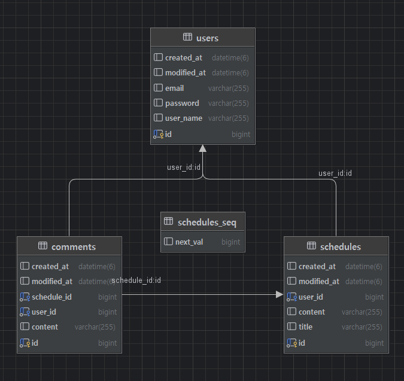
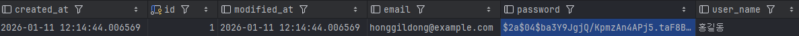

# 일정 관리 애플리케이션 API 명세서

## Base URL
```
http://localhost:8080
```

---

## 인증

### 1. 회원가입
```http
POST /signup
```
**Request**
```json
{
  "userName": "홍길동",
  "email": "honggildong@example.com",
  "password": "12345678"
}
```
**Response** `201 Created`
```json
{
  "id": 1,
  "userName": "홍길동",
  "email": "honggildong@example.com",
  "createdAt": "2026-01-11T11:11:11",
  "modifiedAt": "2026-01-11T11:11:11"
}
```


### 2. 로그인
```http
POST /login
```
**Request**
```json
{
  "email": "honggildong@example.com",
  "password": "12345678"
}
```
**Response** `200 OK`
- Headers: `Set-Cookie: JSESSIONID=...`


### 3. 로그아웃
```http
POST /logout
```
**Headers**: `Cookie: JSESSIONID=...`

**Response** `204 No Content`


## 유저

### 1. 전체 유저 조회
```http
GET /users
```
**Response** `200 OK`
```json
[
  {
    "id": 1,
    "userName": "홍길동",
    "email": "honggildong@example.com",
    "createdAt": "2026-01-11T11:11:11",
    "modifiedAt": "2026-01-11T11:11:11"
  }
]
```


### 2. 단건 유저 조회
```http
GET /users/{userId}
```
**Response** `200 OK`
```json
{
  "id": 1,
  "userName": "홍길동",
  "email": "hong@example.com",
  "createdAt": "2026-01-11T11:11:11",
  "modifiedAt": "2026-01-11T11:11:11"
}
```


### 3. 유저 수정
```http
PUT /users/{userId}
```
**Request**
```json
{
  "userName": "홍길동2",
  "email": "honggildong2@example.com",
  "password": "11111111"
}
```
**Response** `200 OK`
```json
{
  "id": 1,
  "userName": "홍길동2",
  "email": "honggildong2@example.com",
  "createdAt": "2026-01-11T11:11:11",
  "modifiedAt": "2026-01-11T11:11:11"
}
```


### 4. 유저 삭제
```http
DELETE /users/{userId}
```
**Response** `204 No Content`


## 일정

> **모든 일정 API는 로그인 필요**

### 1. 일정 생성
```http
POST /schedules
```
**Headers**: `Cookie: JSESSIONID=...`

**Request**
```json
{
  "userId": 1,
  "title": "제목",
  "content": "내용"
}
```
**Response** `201 Created`
```json
{
  "id": 1,
  "userId": 1,
  "userName": "홍길동",
  "title": "제목",
  "content": "내용",
  "createdAt": "2026-01-11T11:11:11",
  "modifiedAt": "2026-01-11T11:11:11"
}
```


### 2. 전체 일정 조회
```http
GET /schedules
```
**Headers**: `Cookie: JSESSIONID=...`

**Response** `200 OK`
```json
[
  {
    "id": 1,
    "userId": 1,
    "userName": "홍길동",
    "title": "제목",
    "content": "내용",
    "createdAt": "2026-01-11T11:11:11",
    "modifiedAt": "2026-01-11T11:11:11"
  }
]
```


### 3. 단건 일정 조회
```http
GET /schedules/{scheduleId}
```
**Headers**: `Cookie: JSESSIONID=...`

**Response** `200 OK`
```json
{
  "id": 1,
  "userId": 1,
  "userName": "홍길동",
  "title": "제목",
  "content": "내용",
  "createdAt": "2026-01-11T11:11:11",
  "modifiedAt": "2026-01-11T11:11:11"
}
```


### 4. 일정 수정
```http
PUT /schedules/{scheduleId}
```
**Headers**: `Cookie: JSESSIONID=...`

**Request**
```json
{
  "title": "제목 (수정)",
  "content": "내용 (수정)"
}
```
**Response** `200 OK`
```json
{
  "id": 1,
  "userId": 1,
  "userName": "홍길동",
  "title": "제목 (수정)",
  "content": "내용 (수정)",
  "createdAt": "2026-01-11T11:11:11",
  "modifiedAt": "2026-01-11T11:11:11"
}
```


### 5. 일정 삭제
```http
DELETE /schedules/{scheduleId}
```
**Headers**: `Cookie: JSESSIONID=...`

**Response** `204 No Content`

---

## 댓글

> **모든 댓글 API는 로그인 필요**

### 1. 댓글 생성
```http
POST /schedules/{scheduleId}/comments
```
**Headers**: `Cookie: JSESSIONID=...`

**Request**
```json
{
  "userId": 1,
  "scheduleId": 1,
  "content": "댓글내용"
}
```
**Response** `201 Created`
```json
{
  "id": 1,
  "scheduleId": 1,
  "userId": 1,
  "content": "좋은 일정이네요!",
  "createdAt": "2026-01-11T11:11:11",
  "modifiedAt": "2026-01-11T11:11:11"
}
```


### 2. 특정 일정의 댓글 조회
```http
GET /schedules/{scheduleId}/comments
```
**Headers**: `Cookie: JSESSIONID=...`

**Response** `200 OK`
```json
[
  {
    "id": 1,
    "scheduleId": 1,
    "userId": 1,
    "content": "댓글내용",
    "createdAt": "2026-01-11T11:11:11",
    "modifiedAt": "2026-01-11T11:11:11"
  }
]
```


## ERD




## 에러 응답

### 401 Unauthorized
로그인하지 않은 상태에서 인증 필요 API 호출 시
```
Status: 401 Unauthorized
```

## 주요 기능

**BCrypt 비밀번호 암호화**  

**Cookie/Session 기반 인증**
**User-Schedule-Comment 연관관계**  
**로그인한 사용자만 일정/댓글 작성 가능**


## 테스트

```
1. POST /signup 
2. POST /login
3. POST /schedules
4. GET /schedules
5. POST /schedules/1/comments
6. GET /schedules/1/comments
7. PUT /schedules/1
8. DELETE /schedules/1
9. POST /logout
```
